# Bike-Ride-Sharing-Analysis

## Business Context

Bike sharing systems are new generation of traditional bike rentals where whole process from membership, rental and return back has become automatic. Through these systems, user is able to easily rent a bike from a particular position and return back at another position. Currently, there are about over 500 bike-sharing programs around the world which is composed of over 500 thousands bicycles. Today, there exists great interest in these systems due to their important role in traffic, environmental and health issues.

Apart from interesting real world applications of bike sharing systems, the characteristics of data being generated by these systems make them attractive for the research. Opposed to other transport services such as bus or subway, the duration of travel, departure and arrival position is explicitly recorded in these systems. This feature turns bike sharing system into a virtual sensor network that can be used for sensing mobility in the city. Hence, it is expected that most of important events in the city could be detected via monitoring these data.

## Objective

The aim is to build a predictive model and find out the count of total rental bikes given season, weekday, weather, temperature and other features. Using this model, the bike sharing companies can plan the count of bikes needed (demand) and pricing. Also, this can be used to sense mobility in the city by government authorities and manage the traffic accordingly.

This is a supervised machine learning problem with a target label as “count” Also since we are expected to predict a predict the count of bikes, it becomes a regression task.

## Dataset Information

•	instant: record index  
•	dteday : date  
•	season : season (1:winter, 2:spring, 3:summer, 4:fall)  
•	yr : year (0: 2011, 1:2012)  
•	mnth : month ( 1 to 12)  
•	hr : hour (0 to 23)  
•	holiday : weather day is holiday or not (extracted from [Web Link])  
•	weekday : day of the week  
•	workingday : if day is neither weekend nor holiday is 1, otherwise is 0.  
•	weathersit :  
1: Clear, Few clouds, Partly cloudy, Partly cloudy  
2: Mist + Cloudy, Mist + Broken clouds, Mist + Few clouds, Mist  
3: Light Snow, Light Rain + Thunderstorm + Scattered clouds, Light Rain + Scattered clouds  
4: Heavy Rain + Ice Pallets + Thunderstorm + Mist, Snow + Fog  
•	temp : Normalized temperature in Celsius. The values are derived via (t-t_min)/(t_max-t_min), t_min=-8, t_max=+39 (only in hourly scale)  
•	atemp: Normalized feeling temperature in Celsius. The values are derived via (t-t_min)/(t_max-t_min), t_min=-16, t_max=+50 (only in hourly scale)  
•	hum: Normalized humidity. The values are divided to 100 (max)  
•	windspeed: Normalized wind speed. The values are divided to 67 (max)  
•	casual: count of casual users  
•	registered: count of registered users  
•	cnt: count of total rental bikes including both casual and registered  

## Exploratory Data Analysis

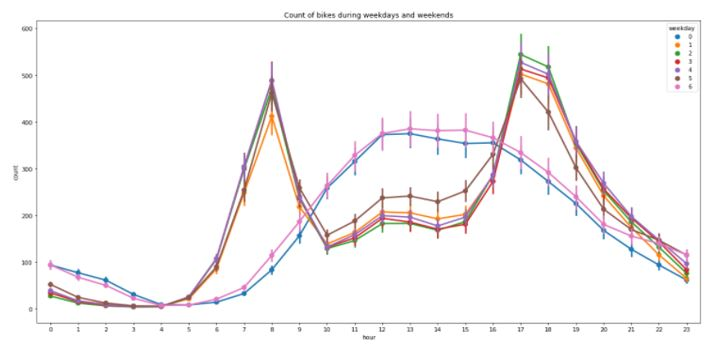

From the above plot, it can be seen that, on weekdays, demand for bikes gains traction around 6:30 a.m. till 9 a.m. and also there is high demand from 4 p.m to 7 p.m. in the evening. On weekends, there is high demand for bikes from 11 a.m to 5 p.m.

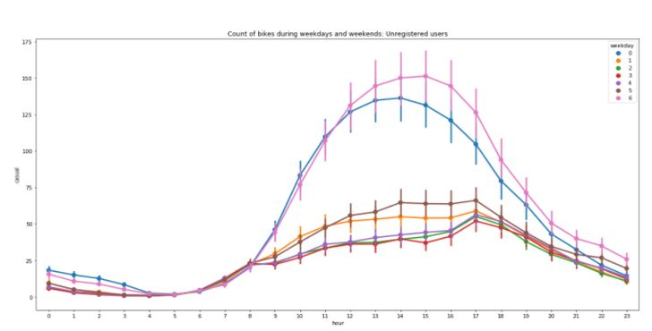

From the above plot, it is evident that, for casual (unregistered) users, the count is more on weekends.

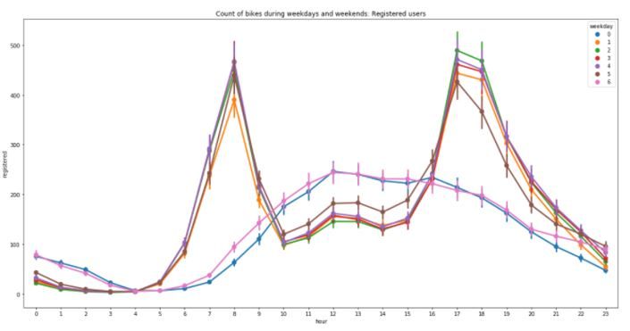

From the above plot, we can see that, count for registered users is more on weekdays when compared to weekends.

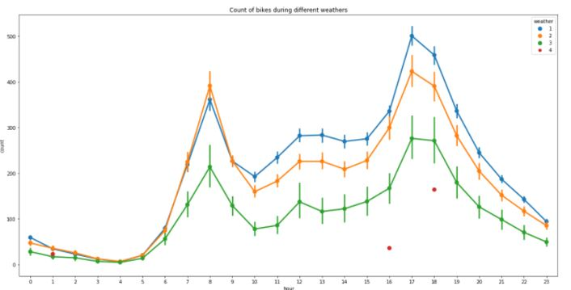

From the above plot, it can be seen that, during heavy rain, the demand is very low

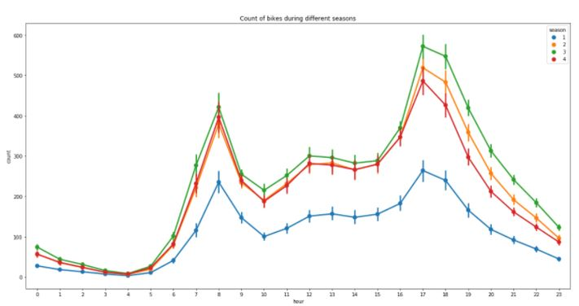

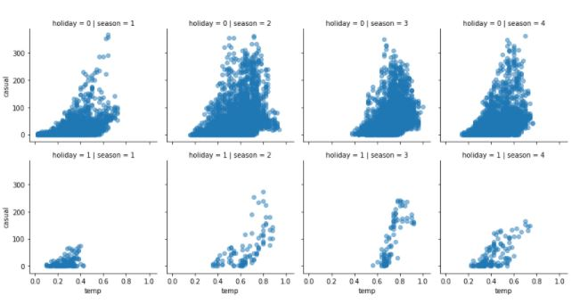

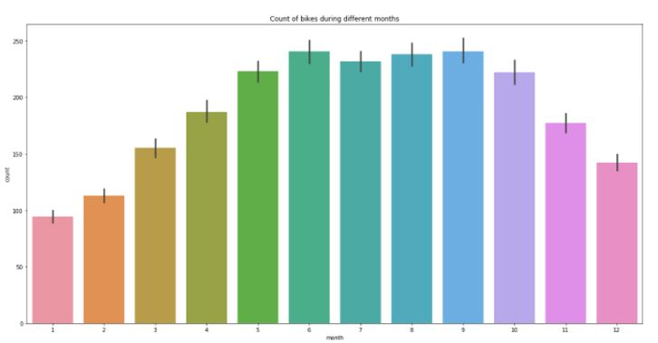

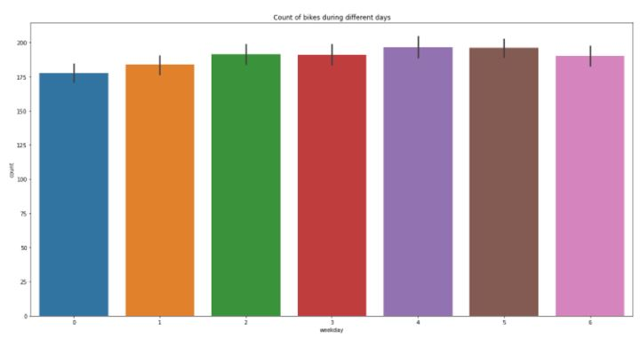

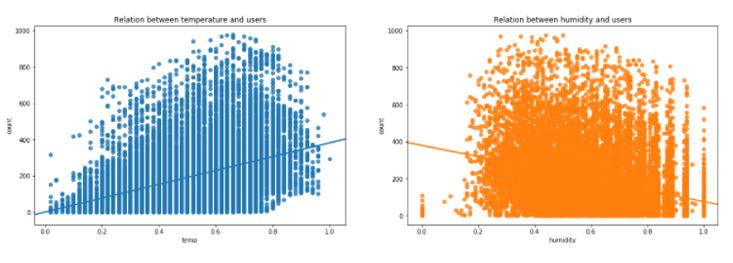

## Outlier Detection and Treatment

Number of Outliers in temp = 0  
Number of Outliers in humidity = 22  
Number of Outliers in count = 244  

So, we have 2 features with outliers present. We will be removing these outliers from our dataset.

### Before Outlier Treatment: 

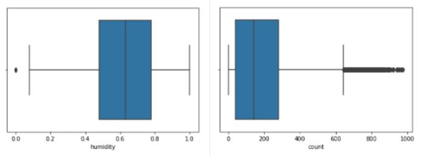

After Outlier Treatment: 

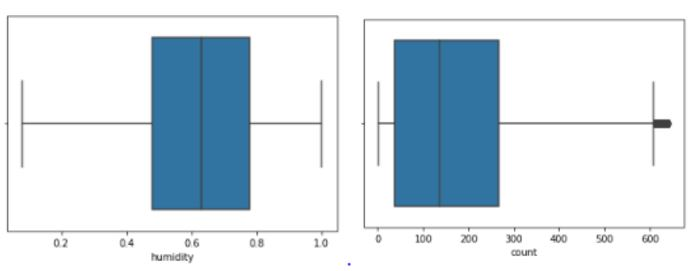

Before Log transformation:

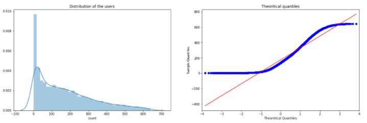

After Log transformation: 

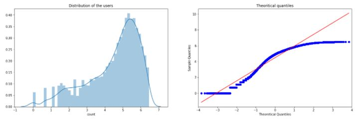

## Correlation Matrix

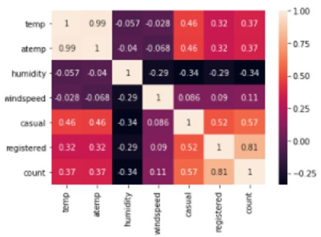

INFERENCES FROM THE ABOVE HEATMAP  
1.self realtion i.e. of a feature to itself is equal to 1 as expected.  
2.temp and atemp are highly related as expected.  
3.humidity is inversely related to count as expected as the weather is humid people will not like to travel on a bike.  
4.Also note that temp(or atemp) highly effects the count.  
5.Also note that weather and count are highly inversely related. This is because, for our data as weather increases from (1 to 4) implies that weather is getting more worse and so lesser people will rent bikes.  
6.registered/casual and count are highly related which indicates that most of the bikes that are rented are registered.  
7.similarly we can draw some more inferences like windspeed and humidity and so on....  

## Feature Engineering

1. Log transformed “count” feature  
2. Dropped “atemp” feature as it was just a transformed variable of “temp” with complete correlation  
3. Did outlier treatment using IQR method.  
4. Rest of the dataset was fairly clean  

## Model Training and Evaluation:

The ML models trained were:  
1. Linear Regression  
2. Ridge Regression  
3. Huber Regressor  
4. Decision Tree Regressor  
5. Random Forest Regressor  
6. ElasticNetCV  
7. Extra Trees  
8. Gradient Boosting  

Random Forest Regressor gave the best results:  

Model Report  
MSE: 0.27382082251627576

## Feature Importances:

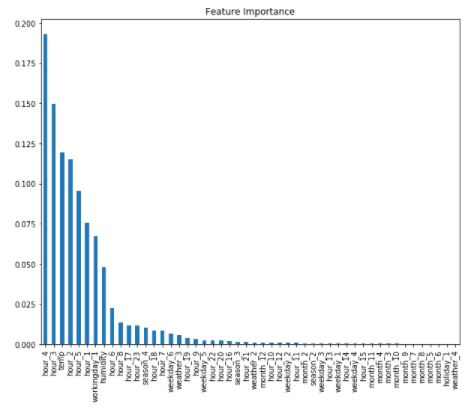

